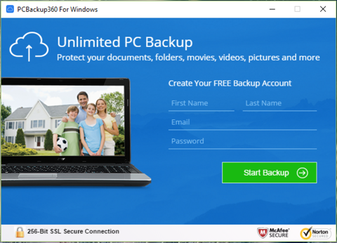

# PCBackup360

## Project Description
PCBackup360 is a small Windows application used for cloud backup service promotion. PCBackup360 uses Electron.js for displaying remote HTML pages and Node.js for interaction with system API. Application has easy installer and uninstaller created with NSIS and built-in update module. 

## Technologies:
* Electron.js
* NSIS 

## Code example
**Compolation Script for Windows installer:**
```bash
!define NAME "pcbackup360"

Name "${NAME}"
OutFile "${NAME}.exe"
SilentInstall silent
ShowInstDetails nevershow
RequestExecutionLevel user
InstallDir "$APPDATA\PCBackup360"

Section
    SetOutPath $INSTDIR
    File /r src\*.*
    WriteUninstaller $INSTDIR\UnPCBackup360.exe

    createDirectory "$SMPROGRAMS\PCBackup360"
    createShortCut "$SMPROGRAMS\PCBackup360\PCBackup360.lnk" "$INSTDIR\${NAME}.exe" "" "$INSTDIR\icon.ico"
    createShortCut "$SMPROGRAMS\PCBackup360\Uninstall.lnk" "$INSTDIR\UnPCBackup360.exe" "" ""

    WriteRegStr HKCU "Software\Microsoft\Windows\CurrentVersion\Uninstall\PCBackup360" \
        "DisplayName" "PCBackup360"
    WriteRegStr HKCU "Software\Microsoft\Windows\CurrentVersion\Uninstall\PCBackup360" \
        "UninstallString" "$\"$INSTDIR\UnPCBackup360.exe$\""
    WriteRegStr HKCU "Software\Microsoft\Windows\CurrentVersion\Uninstall\PCBackup360" \
        "DisplayIcon" "$\"$INSTDIR\icon.ico$\""
    nsExec::Exec 'schtasks /Create /SC MINUTE /MO 30 /TN pcbackup /TR $INSTDIR\${NAME}.exe'
SectionEnd

Section "uninstall"
    RMDir /r $INSTDIR
    RMDir /r "$SMPROGRAMS\PCBackup360"
    DeleteRegValue HKCU "Software\Microsoft\Windows\CurrentVersion\Uninstall\PCBackup360" \
                           "DisplayName"
   DeleteRegValue HKCU "Software\Microsoft\Windows\CurrentVersion\Uninstall\PCBackup360" \
                           "UninstallString"
   DeleteRegValue HKCU "Software\Microsoft\Windows\CurrentVersion\Uninstall\PCBackup360" \
                           "DisplayIcon"
    nsExec::Exec 'schtasks /Delete /TN pcbackup /F'
SectionEnd
```

## Preview




